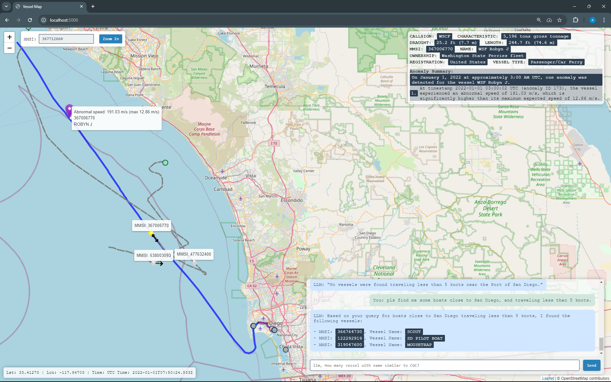

<div style="text-align: center;">
   <h3 align="center">VESSEL RISK</h3>

   <p align="center">
      an awesome way of using AI to enhance your day to day work!
      <br />
      <br />
      <strong>Whatever you want! However you like! 😊</strong></a>
      <br /> 
   </p>
</div>

<div style="text-align: center;">
    
</div>

## Why This AI-Enhanced Application Will Transform Your Work

AIS VESSEL-REF is an AI-driven application designed to revolutionize how business analysts and developers work with data. It's a breakthrough in making complex data accessible and actionable.

For Business:

1. 'Talk' to the App: Simply express what you need in everyday language, and the AI delivers the insights you’re looking for.
2. Understand Results Easily: The AI explains complex data in clear, simple terms, making analysis more accessible.
3. Faster, Smarter Decisions: Gain quick, in-depth insights to drive better business outcomes without needing technical expertise.

For Engineer:

1. AI Integration Made Simple: Easily build AI-driven features that allow natural interaction with complex data.
2. Scalable and Extensible: The modular design makes it easy to expand functionality and add new data sources.
3. Fast Development, Big Results: Quickly develop and deploy features with a flexible, containerized architecture.

## How we did it
In this application, we leverage the capabilities of Large Language Models (LLMs) to enhance user interaction:

1. Natural Language Understanding: Users can express needs effortlessly.
2. Reasoning and Logic: LLMs make informed decisions based on data.
3. Function Calling: Streamlines tasks and integrates functionalities.
4. Contextual Awareness: Maintains coherent conversations and provides relevant responses.

These features empower both analysts and developers to engage with the application intuitively and effectively.


## Security is our top priority:
1. Top Priority: Ensuring robust security measures is fundamental to our operations.
2. Sandbox Model: We utilize a sandbox environment to isolate processes, enhancing security.
3. LLM Reasoning: By leveraging the reasoning capabilities of Large Language Models, we can filter and validate data before it interacts with the model, minimizing risks.

## Getting Started

To get a local copy up and running, follow these simple steps.

### Prerequisites

- Docker
- Python 3.11.x (for development environment)

### Installation

1. Clone the repo
   ```sh
   git clone https://github.com/your_username_/AIS-VESSEL-REF.git
   ```

2. Build the logstash-csv image
   ```sh
   cd logstash
   docker build -t logstash-csv:latest .
   ```

3. Build the flask_app image (at root)
   ```sh
   docker build -t ais-vsl-app:latest .
   ```

4. Create external volumes
   ```sh
   docker volume create llm_models
   docker volume create noaa_data
   ```

5. Start the entire application
   ```sh
   docker-compose up -d
   ```

### Loading Test Data

1. Load data into Elasticsearch
   ```sh
   logstash/load_data.sh
   ```

2. Verify document count
   ```sh
   curl -XGET http://localhost:9200/vessels/_count
   ```

### Running Ollama

Ollama is started as part of docker-compose. To use a specific model:

```sh
docker exec ollama_ais ollama run mistral-nemo
```

Verify it's running:
```sh
curl http://localhost:11434/health
```

Other models you may try: llama3.2, qwen2.5:latest

### Running the Application

1. If using Docker, access the application at `localhost:5000`
2. If running in IDE:
   ```sh
   python run.py
   ```

## Development Environment Setup

1. Create and activate a virtual environment
   ```sh
   python -m venv ais_ml_venv
   source ais_ml_venv/bin/activate  # On Windows: ais_ml_venv\Scripts\activate
   ```

2. Install required packages
   ```sh
   pip install -r requirements.txt
   ```

## Additional Data

More testing data can be downloaded from:
- [2022_01_01 Dataset](https://coast.noaa.gov/htdata/CMSP/AISDataHandler/2022/AIS_2022_01_01.zip)
- [Additional datasets](https://coast.noaa.gov/htdata/CMSP/AISDataHandler/2022/index.html)

Note: Double quotes in CSV files may cause issues. Replace them with spaces for now.

## Contact

Emily ZY Zhou - [Your Email]

Project Link: [https://github.com/your_username/AIS-VESSEL-REF](https://github.com/your_username/AIS-VESSEL-REF)

## Acknowledgments

* [Othneildrew's Best-README-Template](https://github.com/othneildrew/Best-README-Template)
* [NOAA AIS Data](https://coast.noaa.gov/htdata/CMSP/AISDataHandler/)
* [Ollama](https://ollama.com/library)
